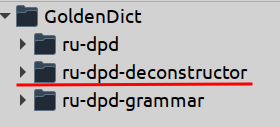

# Разбор составных слов и разделение сандхи

Деконструктор DPD теперь доступен как отдельный словарь.

В настоящее время он содержит около 700 000 разобранных слов, охватывая все книги в **тексте Chaṭṭha Saṅgāyana**, *mūla*, *aṭṭhakathā*, *ṭīkā* и *aññā*, а также все палийские тексты на **Sutta Central**. Это число будет уменьшаться по мере добавления новых сочетаний в DPD.

## Как установить

Скачайте последнюю версию деконструктора DPD для GoldenDict или MDict с [этой страницы на GitHub](https://github.com/) и поместите его в ту же папку, что и DPD.

## Немного информации

Сандхи-сочетания - это самое большое препятствие для любого начинающего изучающего палийский язык. Правила сандхи не являются абсолютными правилами, а только возможностями морфологических изменений в зависимости от контекста. Эти правила сложны и трудны в понимании для начинающего.

Ситуация только усугубляется в комментариях, где не редко встречаются чрезвычайно длинные составные слова, включая такие гиганты, как *avippavāsasammutisanthatasammutibhattuddesakasenāsanaggāhāpakabhaṇḍāgārikacīvarappaṭiggāhakayāgubhājakaphalabhājakakhajjabhājakaappamattakavissajjakasāṭiyaggāhapakapattaggāhāpakaārāmikapesakasāmaṇerapesakasammutīti*, *bhattuddesakasenāsanaggāhāpakabhaṇḍāgārikacīvarapaṭiggāhakacīvarabhājanakayāgubhājanakaphalabhājanakakhajjabhājanakaappamattakavissajjakasāṭiyaggāhāpakapattaggāhāpakaārāmikapesakasāmaṇerapesakasammutīnaṃ* и *āsavavippayuttasāsavasaṃyojanavippayuttasaṃyojaniyaganthavippayuttaganthaniyanīvaraṇavippayuttanīvaraṇiyaparāmāsavippayuttaparāmaṭṭhakilesavippayuttasaṅkilesikapariyāpannasauttaradukāta*.

Сандхи - самое большое препятствие, с которым сталкиваются все формы вычислительной лингвистики, связанные с палийским каноном. В настоящее время это препятствует любому реальному развитию в этой области.

Никто еще не нашел удовлетворительного решения этой задачи.

Единственное текущее решение, которое в какой-то мере полезно, - это [функция анализа DPR](https://www.digitalpalireader.online/_dprhtml/index.html?loc=m.0.0.0.0.1.2.m&amp;analysis=cakkhundriyasa.mvarasa.mvuto&amp;frombox=1), которая часто неправильна и вводит в заблуждение столько же, сколько и правильна. По-видимому, используемый ею метод - это система замен регулярных выражений для удаления склонений и сокращения составных слов до словарных слов.

## Новый подход

Один из полезных продуктов Цифрового Палийского Словаря - это список склонений для каждого слова в словаре. Вместе с набором [правил трансформации букв](https://github.com/bdhrs/sqlite-db/blob/d9da7d1ae69dd9dec0aef37d7c6bbc48871ab555/sandhi/sandhi_related/sandhi_rules.tsv) этот список был использован для создания нового алгоритма разделения сандхи.

Это все еще в процессе и далеко не идеально - для понимания контекста всегда требуется интеллект, - но это лучше, чем все, что существует в настоящее время, давая более точные результаты и, самое главное, меньше ложных срабатываний.

Например, если вы откроете *bahalamadhukatelanāgabalapicchillādīnaṃ* в DPD, он покажет разбиение, по которому можно перейти к соответствующим словам.

