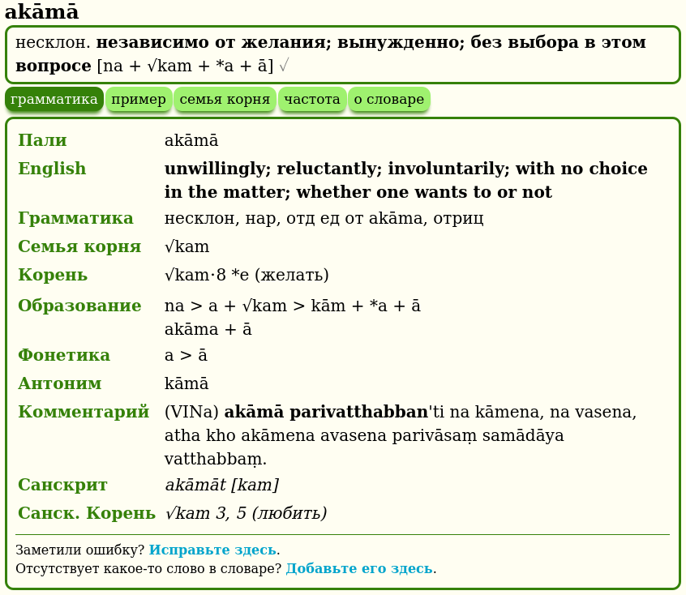
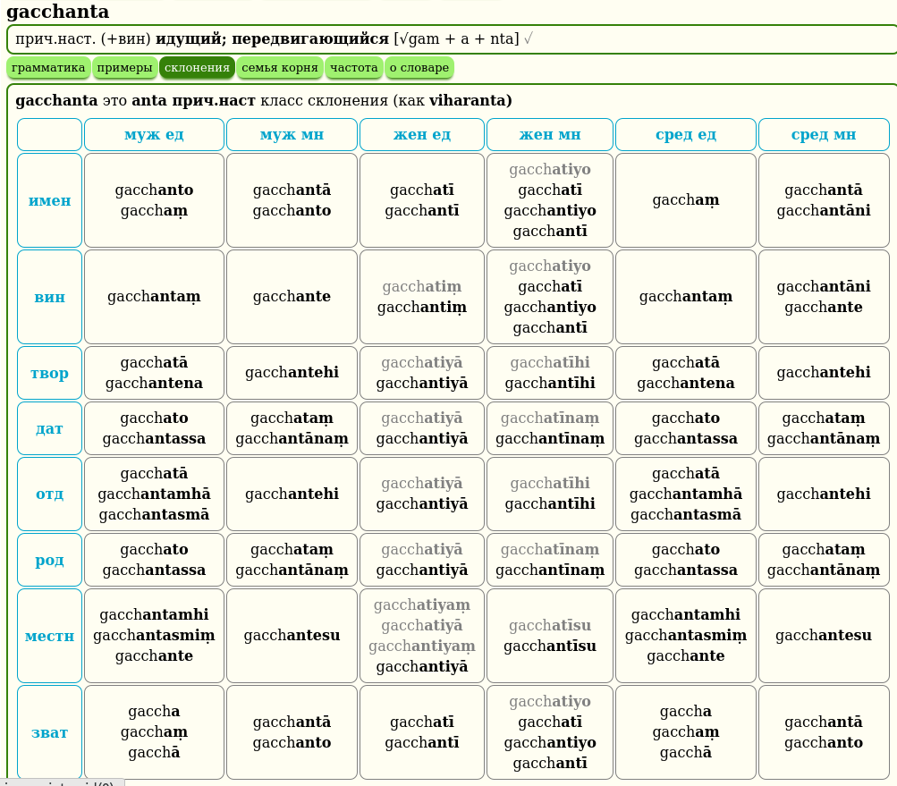
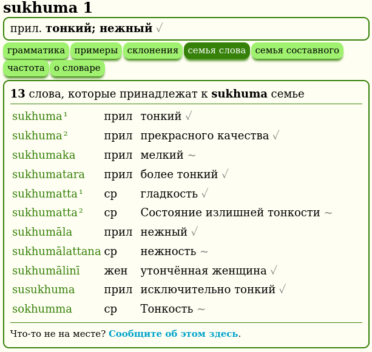
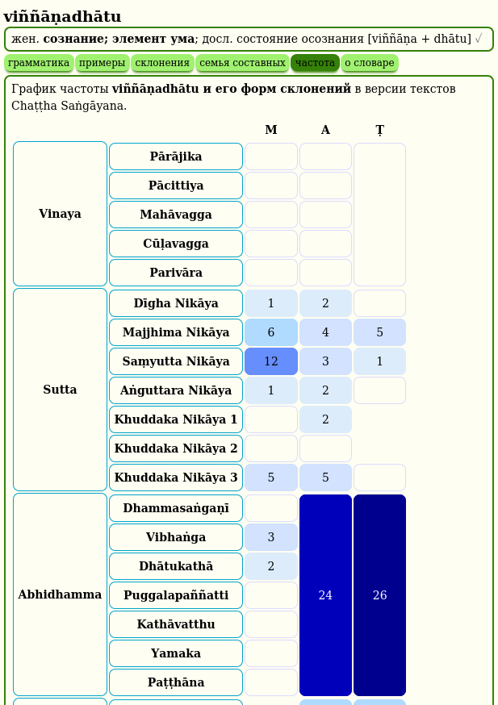
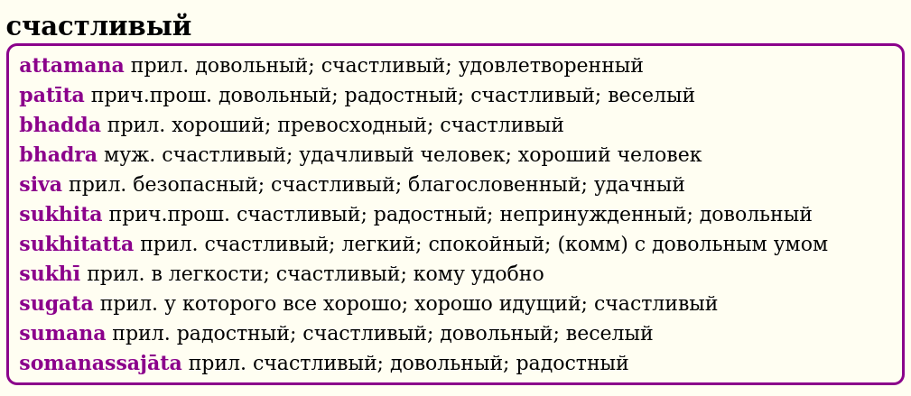
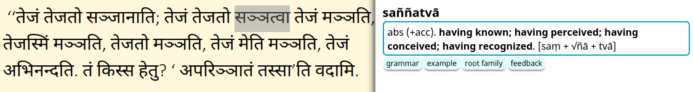
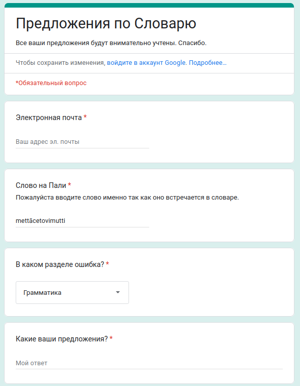

# Особенности

## DPD содержит четыре различных словаря

### Словарь палийского языка на английский (синий)

### Словарь корней палийского языка (оранжевый)

Для получения дополнительной информации [нажмите здесь](rootdict.html)

### Словарь русского на палийский язык (фиолетовый)

### Словарь сокращений и помощи (зеленый)

## Два дополнительных словаря

Существует два дополнительных словарных набора, которые работают в связке с DPD. Первый посвящен [разбору составных слов и разложению сложных слов](sandhi.html), а второй - [грамматический словарь](grammardict.html), который может объяснить падеж каждого измененного слова в тексте. Щелкните по ссылкам, чтобы узнать больше.

## DPD распознает 1,5 миллиона уникальных измененных форм слов палийского языка

Когда вы выбираете слово в тексте на палийском языке и нажимаете сочетание клавиш, DPD автоматически определяет все главные слова, к которым принадлежит эта измененная форма. Например, клик по *takkarassa* автоматически откроет *takkara*.

## 100% Распознавание словаря в этих книгах

DPD распознает все слова, как в **Chaṭṭha Saṅgāyana Tipiṭaka**, так и в **Mahāsaṅgīti** издании на Sutta Central, включая все сложные слова и соединения, в следующих книгах:
- **Виная**: Pārājikapāḷi , Pācittiyapāḷi 
- **Сутты**: Все четыре Никаи 
- **Кхуддака Никая**: Khuddakapāṭha, Dhammapada, Udāna, Itivuttaka, Suttanipāta, Theragāthā 
- **Вплоть до**: Therigāthā

## Кликайте по всему

Одна из  значительных особенностей GoldenDict - это возможность щелкнуть по любому слову, чтобы открыть определение этого слова. Это создает бесконечное пространство для изучения языка.

## Компактное представление

Вся важная информация на палийском языке представлена в **одной компактной строке**, доступной на первый взгляд, а более подробная информация доступна при нажатии кнопок.

Основная информация включает часть речи, падеж, значение, буквальное значение и упрощенную конструкцию.

## Система нумерации

Если слова с несколькими значениями происходят из разных источников, их нумерация будет отражать это.

В приведенном выше примере 1.1 и 1.2 оба связаны с санскритским *śara*, в то время как 2.1 происходит от корня √sar (издавать звук), санскритское *svara*.

## Степень завершенности данных о словах

Поскольку DPD находится в процессе выполнения, полезно знать, насколько полны данные о слове. Это указывается серым значком (✓~✗) после записи.
- ✓ серая галочка означает, что данные о слове в основном завершены с контекстуальным значением, грамматической информацией, примерами из сутт и другой соответствующей информацией.
- ~ серая волнистая линия означает, что данные о слове частично завершены с контекстуальным значением и грамматической конструкцией, но минимальной другой информацией.
- ✗ серый крест означает, что данные о слове все еще находятся в процессе создания и содержат только таблицу измененных форм, таблицу частотности и очень базовую информацию.

## Грамматика

Щелкните кнопку **грамматика**, чтобы получить более подробную грамматическую информацию о слове.

Это включает информацию о корне, детальное образование, производное, фонетические изменения, составное слово, антонимы, синонимы, комментарий, неиндоарийские родственные слова, санскритские родственные слова и санскритский корень.

Если вы заметили ошибку, пожалуйста, нажмите ссылку, чтобы исправить ее.

# Примеры

Щелкните кнопку **примеры**, чтобы увидеть соответствующие примеры из сутт, содержащие слово.

Если у вас есть лучший пример, пожалуйста, сообщите нам!

## Склонение / Спряжение

Щелкните кнопку **склонение** или **спряжение**, чтобы увидеть все измененные формы слова.

Эта таблица автоматически генерируется с использованием системы основа + шаблон, например, anicc + o. Неправильные склонения имеют свои собственные уникальные таблицы.
Измененные формы, не найденные в тексте Chaṭṭha Saṅgāyana, отмечены серым.

## Семья корня

Щелкните кнопку **семья корня**, чтобы увидеть все слова, которые имеют тот же префикс + корень.

Эта информация уникальна для DPD и основана на детальном изучении системы корней палийского и санскритского языков. Это отлично подходит для изучения тонких оттенков значений, которые может показывать комбинация корня + префикса.

## Семья слова

Щелкните кнопку **семья слова**, чтобы увидеть все связанные слова, которые не происходят от корня, а созданы из первичного слова с использованием префиксов и суффиксов.

## Семья составного

Щелкните кнопку **семья составного**, чтобы увидеть коллекцию всех составных слов, которые содержат определенное слово.

Если само заглавное слово является составным, будут перечислены все семьи слов компонентов.

## Частотность слова

Щелкните кнопку **частота**, чтобы увидеть карту интенсивности того, где и как часто слово встречается в тексте Chaṭṭha Saṅgāyana.

[Нажмите здесь](frequency.html) для получения более подробной информации об этой интересной функции.

## Английско-палийский словарь

Щелкнув **любое русское слово** в GoldenDict, теперь можно получить доступ к русско-палийскому словарю, который выводит список **точных** совпадений.

Или вы можете использовать **поиск по слову**, чтобы найти слово, фразу или идиому. В раскрывающемся списке будут отображены все возможные варианты.

Или вы можете выделить любое слово, фразу или идиому и использовать **горячую клавишу**.

Эта функция предназначена для начинающих, которые испытывают трудности с переводом с русского на палийский, и более продвинутых студентов, изучающих общение на палийском языке.

## Сингальский, деванагари и тайские скрипты

Хорошая новость для тех, кто читает палийский в сингальском, деванагари или тайском алфавите, DPD распознает все измененные формы во всех трех этих алфавитах.

Транслитерация основана на [Конвертере шрифтов Aksharamukha](https://aksharamukha.appspot.com/about).

## Обратная связь

Один из самых важных аспектов DPD - это обратная связь. Когда вы замечаете ошибку, пожалуйста, нажмите ссылку, чтобы исправить ее. Это открывает форму Google, которая автоматически заполняется заголовком.

Это обычно занимает менее минуты, чтобы зарегистрировать ошибку, и помогает улучшить качество словаря для всех. Если у вас есть другие вопросы или комментарии, пожалуйста, сообщите нам!

## Wikipedia links

All flowers, trees, plants and unusual animals contain a link to a Wikipedia article for more detailed information on the topic. Indian plants are often used in early Buddhist similes, and a picture is worth a thousand words.

## Fonts

If you prefer a sans-serif font, please install [Noto Sans](https://fonts.google.com/noto/specimen/Noto+Sans), it works well with Pāḷi diacritics. If you prefer a serif font, please install [Deja Vu Serif](https://www.fontsquirrel.com/fonts/dejavu-serif), or [Verajja Serif](https://en.m.fontke.com/font/10186264/), a specially created font for Pāḷi text.

----------------------

Enough in theory, here's how to get GoldenDict installed and setup on your machine ([Win](install_win.md) / [Mac](install_mac.md) / [Linux](install_linux.md) / [Android](install_android_dicttango.md)) or [update](update.md) once a month if you're already installed.