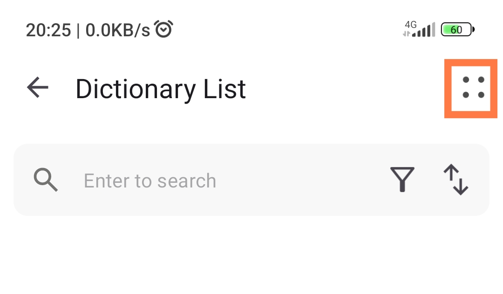
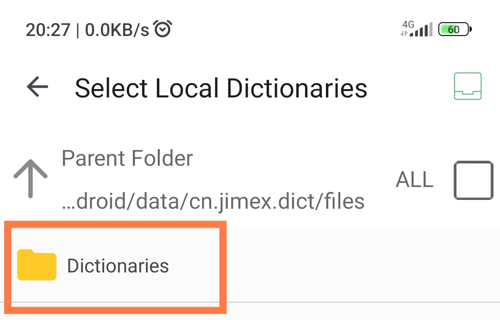
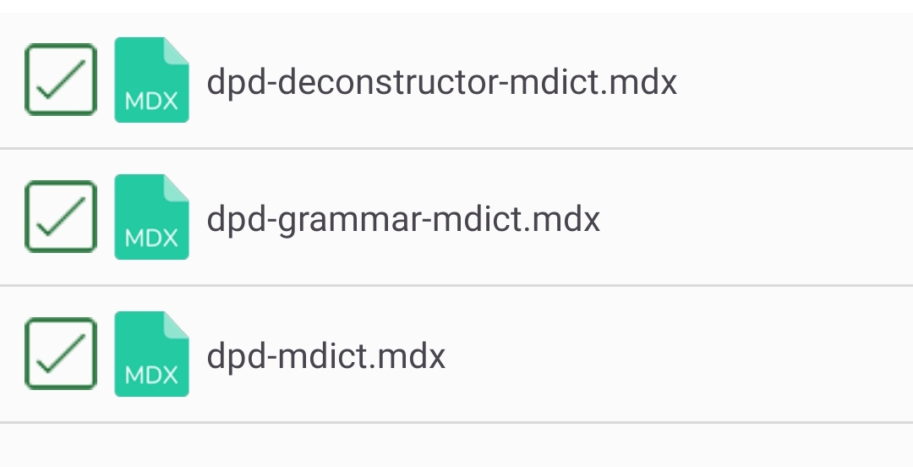
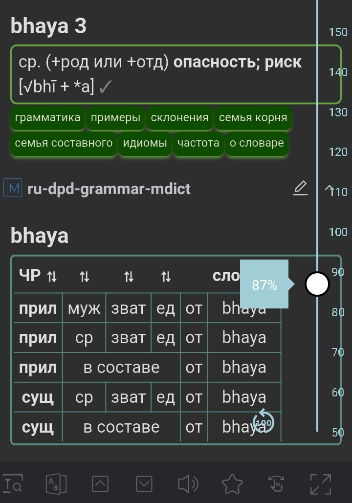
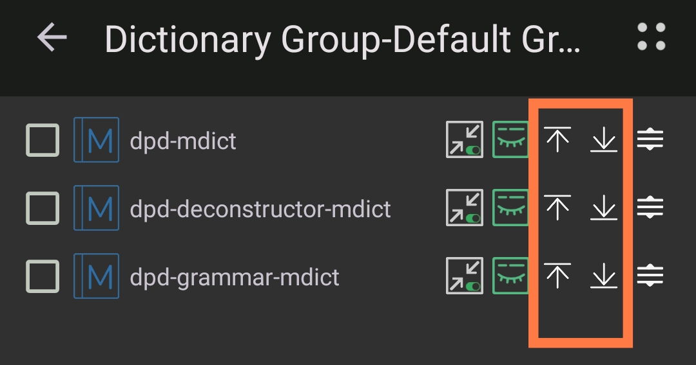

## Установка DictTango на Android

Это поможет вам настроить и настроить DPD в приложении DictTango.

### О DictTango

DictTango использует файлы MDict, но предлагает гораздо более удобный пользовательский опыт, чем само приложение MDict.

- Откройте любое слово из PDF или веб-сайта, удерживая его, и используйте всплывающее меню Android.
- После входа в приложение слова можно навигировать одним щелчком мыши.
- Он также предлагает полный текстовый поиск, а также множество других продвинутых функций.

### Установка Вкратце

1. Скачайте последнюю версию MDict DPD с [Github](https://github.com/digitalpalidictionary/rus-release/releases)
2. Скачайте и установите DictTango из [Google Play Store](https://play.google.com/store/apps/details?id=cn.jimex.dict&pcampaignid=web_shareS) или [APKPure](https://m.apkpure.com/dicttango/cn.jimex.dict)

### Подробные инструкции по установке

Ниже приведены подробные инструкции *anupubba*. Пожалуйста, следуйте им *внимательно*, чтобы получить полную функциональность DPD.

### Скачать и установить DictTango

Скачайте и установите DictTango из [Google Play Store](https://play.google.com/store/apps/details?id=cn.jimex.dict&pcampaignid=web_share) или [APKPure](https://m.apkpure.com/dicttango/cn.jimex.dict)

### Скачать DPD

Скачайте последнюю версию **dpd-mdict.zip** с [Github](https://github.com/digitalpalidictionary/rus-release/releases)

### Скопируйте файлы DPD в папку DictTango

Используя ваш файловый менеджер на выбор, **распакуйте** dpd-mdict.zip.

**Скопируйте** три файла DPD в эту папку: **`/Android/data/cn.jimex.dict/files/Dictionaries`**

⚠️ Если у вас возникают проблемы с безопасностью и вы не можете получить доступ к этой папке, попробуйте скопировать файлы, используя компьютер.

Откройте приложение, чтобы настроить еще несколько параметров.

### Добавить словари

Нажмите на **Управление словарями**.

Нажмите на кнопку **Список словарей** в правом верхнем углу.

Нажмите на **Добавить локальные словари**.

Выберите **Папку словаря**.

Выберите три **флажка**.

Нажмите кнопку **Добавить локальные словари**.

Теперь вы можете искать более миллиона измененных форм слов на пали.

### Темный режим

Если вы предпочитаете темный режим, то

Нажмите **кнопку меню** в правом верхнем углу.

Нажмите на **Настройки**

И выберите предпочтительный для вас темный режим.

Приложение перезапустится в темном режиме.

### Размер шрифта

Чтобы изменить размер шрифта, **откройте** любое слово в словаре.

**Нажмите на эту иконку** в нижнем правом углу.

Переместите **ползунок** вверх и вниз, чтобы изменить размер шрифта.

### Как открыть слово в DictTango

**Долгий клик** на слове на пали в любом PDF, документе или веб-сайте.

Через мгновение появится **меню Android**.

Нажмите на **DictTango**.

Словарные статьи, связанные с измененной формой слова, будут отображены.

После входа в DictTango достаточно **одиночным щелчком** открыть любое слово.

### Отображение всех записей

Чтобы увидеть все записи DPD, следуйте указанным ниже шагам. В противном случае вы увидите только первую запись.

Нажмите кнопку **меню** в правом верхнем углу.

Выберите **Группа словарей**.

Выберите **Группу по умолчанию**.

Выберите **три флажка** словарей DPD.

Нажмите **ЕЩЕ** в правом нижнем углу.

Нажмите на **Автоматическое раскрытие**.

Это все. Теперь вы увидите все записи, относящиеся к любой измененной форме слова на пали.

### Изменение порядка словарей

Пока вы здесь, вы можете изменить порядок отображения словарей.

Переместите словари вверх и вниз, **нажимая стрелки**.

Наслаждайтесь чтением на пали с этим отличным приложением для Android!