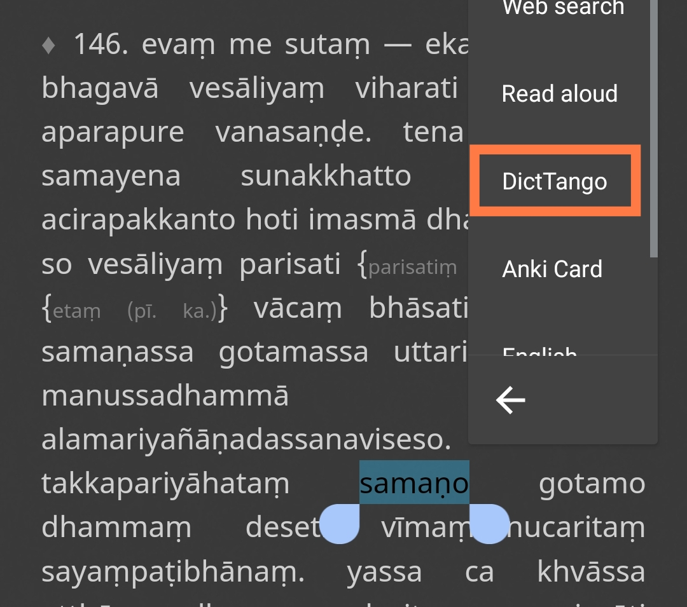
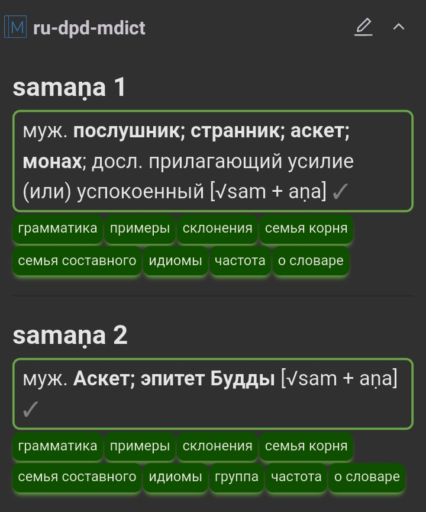

# Install DictTango on Android

## About DictTango

DictTango uses MDict files, but offers a far better user experience than the MDict app itself.
- Open any word from a PDF or webside by long-clinging and using the Android popup menu.
- Once inside the app, words can be naviagted with a single-click.
- It also offers full text search as well as numerous other advanced features.

## Installation In Brief

1. download the latest MDict version of DPD from [Github](https://github.com/digitalpalidictionary/digitalpalidictionary/releases)
2. download and install DictTango from [Google Play Store](https://play.google.com/store/apps/details?id=cn.jimex.dict&pcampaignid=web_shareS) or [APKPure](https://m.apkpure.com/dicttango/cn.jimex.dict)

## Detailed Installation Instructions

Below are detailed *anupubba* instructions. Please follow them *carefully* to get full DPD functionality. 

## Install DictTango

Download and install DictTango from the [Google Play Store](https://play.google.com/store/apps/details?id=cn.jimex.dict&pcampaignid=web_share) or [APKPure](https://m.apkpure.com/dicttango/cn.jimex.dict)

## Download DPD

Download the latest __dpd-mdict.zip__ from [Github](https://github.com/digitalpalidictionary/digitalpalidictionary/releases)

## Copy The DPD Files To The DictTango Folder

Using your file-manager of choice, **unzip** the dpd-mdict.zip.

**Copy** the file 3 files to this folder: **`/Android/data/cn.jimex.dict/files/Dictionaries`**

Open up the app to tweak some more settings.

## Dark Mode

If you prefer dark mode, then

Click the **menu-button** in the top right hand corner.

Click on **Settings**

And choose your preferred dark mode.

The app will restart in Dark Mode.

## Font Size

To adjust the font size, **open** any word in the diciotnary.

**Click on this icon** in the button right hand corner.

Adjust the **slider** to your desired size

## How To Open A Word In DictTango

**Longclick** on a Pāḷi word in any PDF or website.

After a moment, the **Android Menu** will appear.

Click on **DictTango**

Once inside DictTango, just **click** on any word to open it. Easy. 

## Display All Entries

To see all DPD entries, follow the steps below. Otherwise you will only see the first entry.

Click the **menu button** in the top right-hand corner.

Select **Dictionary Group**.

Select the **Default Group**.

Select the **3 checkboxes** of the DPD dictionaries. 

Click **MORE** in the bottom right-hand corner.

Click on **Auto Expand**

That's it. Now you'll see all entries related to any Pāḷi inflection.

Enjoy your Pāḷi reading with this great Android app!
