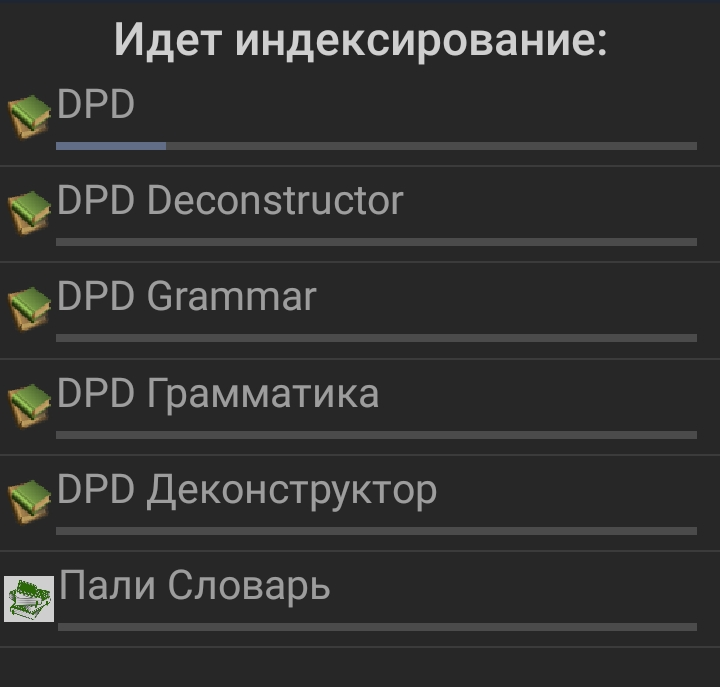

## Установка GoldenDict на Android

GoldenDict на Android можно получить, выделяя слово в тексте и нажимая **Поделиться** в контекстном меню. Он также имеет **темный режим**.

### Вкратце

1. Скачайте последнюю версию DPD [здесь](https://github.com/digitalpalidictionary/rus-release/releases)
2. Установите GoldenDict из [Google Play Store](https://play.google.com/store/apps/details?id=mobi.goldendict.android.free)
3. Скопируйте DPD в папку GoldenDict

Ниже приведены подробные инструкции *anupubba*.

### Загрузить DPD

Прежде всего, загрузите последнюю версию Цифрового Пали Словаря с [Github](https://github.com/digitalpalidictionary/rus-release/releases)

### Загрузить GoldenDict

Скачайте и установите GoldenDict из [Google Play Store](https://play.google.com/store/apps/details?id=mobi.goldendict.android.free)

### Скопировать папку DPD

Используя любой файловый менеджер, скопируйте папку DPD в папку GoldenDict. Вы можете найти ее в корневом каталоге или на SD-карте, если у вас она установлена.

### Запустить GoldenDict

Когда вы запускаете приложение GoldenDict, появится сообщение о необходимости индексации словарей. Нажмите **Начать**.

Дождитесь окончания индексирования и нажмите **Готово**.

Все готово!

Вы можете получить доступ к DPD в любое время из любого приложения, выбрав слово, удерживая его до появления меню опций, и нажав **Поделиться > GoldenDict**.

