# Установка MDict на Android

Пользователям Android рекомендуется использовать приложение [DictTango](install_android_dicttango.html) вместо MDict. Оно предлагает намного лучший пользовательский опыт и имеет множество дополнительных опций.

Если вы все еще предпочитаете использовать MDict, вот как его настроить.

## В кратце

1. Скачайте последнюю версию MDict DPD с [Github](https://github.com/digitalpalidictionary/digitalpalidictionary/releases).
2. Скачайте и установите MDict из [Google Play Store](https://play.google.com/store/apps/details?id=cn.mdict&amp;hl=en&amp;gl=US) или с [сайта MDict](https://www.mdict.cn/wp/?page_id=5325&amp;lang=en).
3. Скопируйте DPD в папку MDict.

Ниже приведены подробные инструкции *anupubba*.

## Загрузить DPD

Прежде всего, загрузите последнюю версию MDict DPD с [Github](https://github.com/digitalpalidictionary/digitalpalidictionary/releases).

## Загрузить MDict

Скачайте и установите MDict из [Google Play Store](https://play.google.com/store/apps/details?id=cn.mdict&amp;hl=en&amp;gl=US) ИЛИ с [сайта MDict](https://www.mdict.cn/wp/?page_id=5325&amp;lang=en).

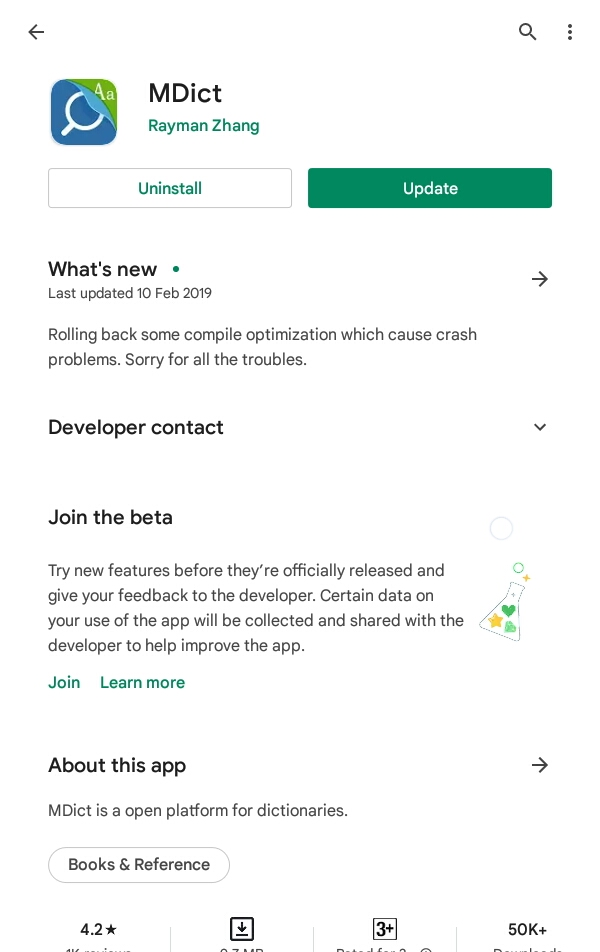

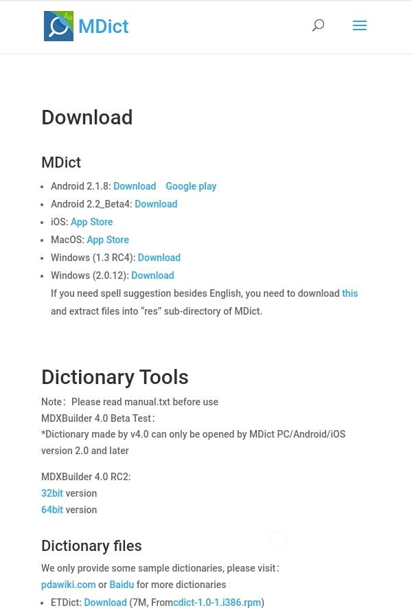

## Скопировать файл dpd в папку MDict

Используя любой файловый менеджер, создайте папку **MDict/doc** на вашей SD-карте.  
(Это папка с названием **MDict** и подпапка с названием **doc**.)

**Скопируйте** файл dpd.mdx в папку **MDict/doc**.

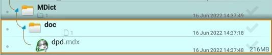

## Настройка MDict

Вы увидите этот экран при первом запуске MDict

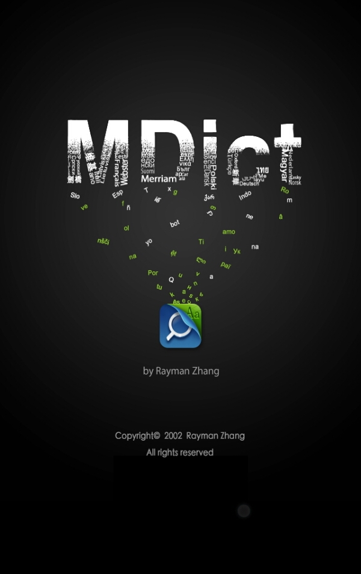

Откройте **Библиотеку**.

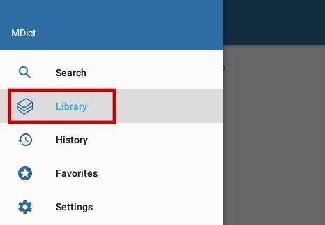

Проверьте, что **DPD** - это ваша библиотека.

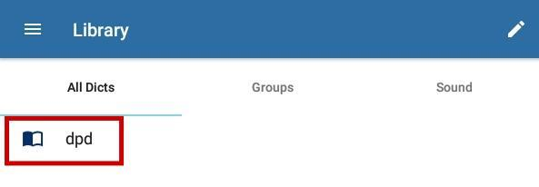

Выберите **Группы > Все**. Это важно, если вы хотите видеть **все определения** слова.

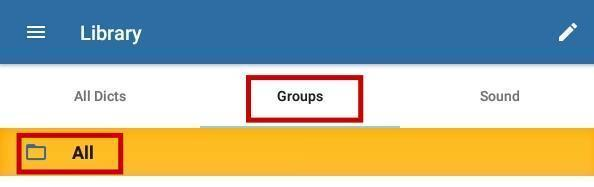

Откройте **Настройки**.

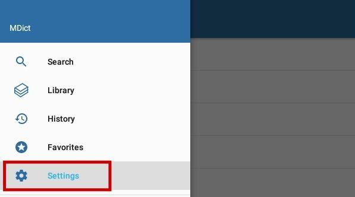

Нажмите на **Поиск**.

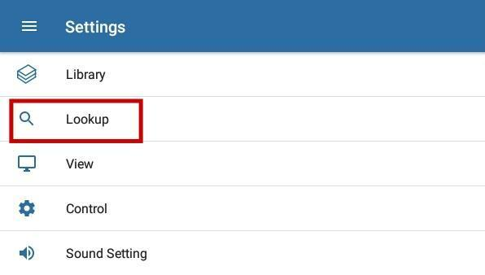

Убедитесь, что **Глобальный монитор буфера обмена** включен. Это позволяет открывать в MDict все, что было скопировано в буфер обмена.

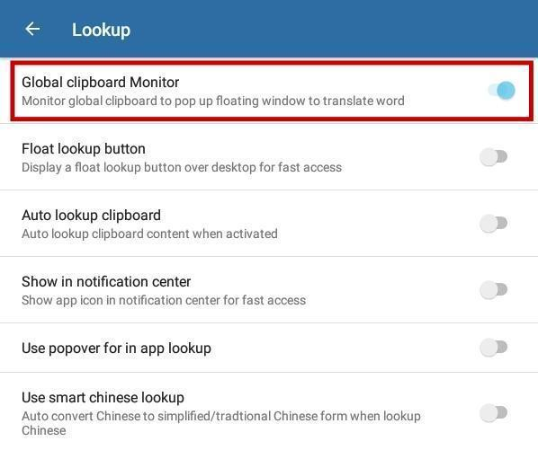

Удерживайте любое палийское слово в любом тексте, чтобы его **выделить**, нажатие на **копировать** откроет его в MDict.

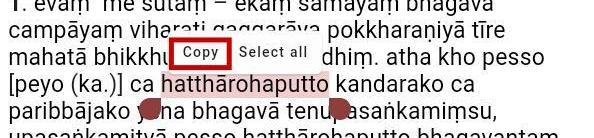

## Настройки DPR

Как дополнительный бонус, если вы используете Цифровой Пали Читатель, откройте **Настройки** и включите **Копировать слова в буфер обмена по щелчку**. Теперь просто щелкнув по любому слову, вы должны увидеть его в MDict.

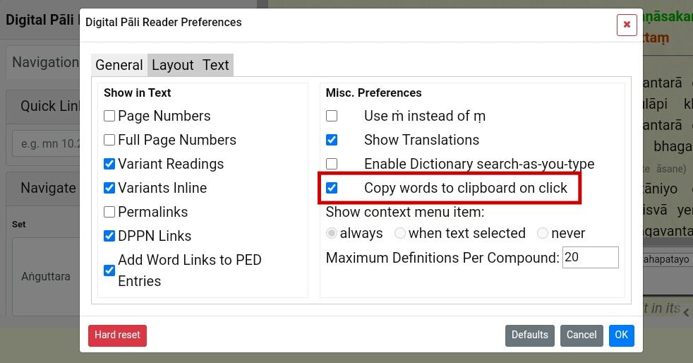

Вы настроили все на Android!