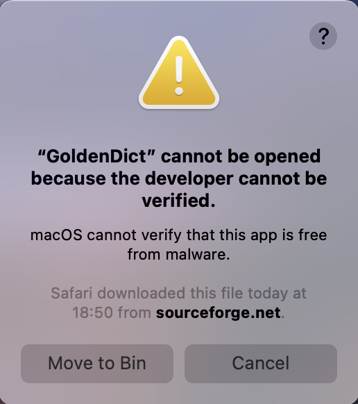

# Установка GoldenDict на Mac

## Кратко
1. Скачайте последнюю версию DPD [здесь](https://github.com/digitalpalidictionary/digitalpalidictionary/releases).
2. Установите версию 1.5 GoldenDict для [OS X 10.9 Mavericks и выше](https://sourceforge.net/projects/goldendict/files/early%20access%20builds/MacOS/GoldenDict-1.5.0-RC2-372-gc3ff15f%28Qt_563%29.dmg/download) или [OS X 10.12 Sierra и выше](https://sourceforge.net/projects/goldendict/files/early%20access%20builds/MacOS/GoldenDict-1.5.0-RC2-372-gc3ff15f%28Qt_5121%29.dmg/download).
3. В настройках направьте GoldenDict в папку DPD.

Ниже подробные инструкции *anupubba*.

## Скачать GoldenDict
- Если вы используете OS X 10.9 Mavericks или более позднюю версию, [скачайте эту версию GoldenDict с Sourceforge](https://sourceforge.net/projects/goldendict/files/early%20access%20builds/MacOS/GoldenDict-1.5.0-RC2-372-gc3ff15f%28Qt_563%29.dmg/download).
- Если вы используете OS X 10.12 Sierra или более позднюю версию, [скачайте эту версию GoldenDict с Sourceforge](https://sourceforge.net/projects/goldendict/files/early%20access%20builds/MacOS/GoldenDict-1.5.0-RC2-372-gc3ff15f%28Qt_5121%29.dmg/download).
- Более подробную информацию о последней версии GoldenDict для Mac можно найти [здесь](https://github.com/goldendict/goldendict/wiki/Early-Access-Builds-for-Mac-OS-X).

## Установка GoldenDict
1. Дважды щелкните файл .dmg GoldenDict в папке Загрузки.
   
2. Дважды щелкните установщик.
   
3. Вероятно, вы получите предупреждение безопасности. Нажмите "Открыть в любом случае".
   
4. Нажмите "Открыть" на следующем предупреждении безопасности.
   
5. Установка завершена.

## Скачать DPD
Скачайте последнюю версию Цифрового Палийского Словаря для GoldenDict с [Github](https://github.com/digitalpalidictionary/digitalpalidictionary/releases) в вашу папку Загрузки.

## Распаковка
Найдите файл .zip в папке Загрузки и распакуйте его.

## Создание папки GoldenDict
- Рекомендуется создать легко доступную папку GoldenDict, например `/Documents/GoldenDict`.
  
- Скопируйте распакованную папку DPD в `/Documents/GoldenDict`.
  

## Добавление словарей в GoldenDict
1. Запустите приложение GoldenDict.
2. Перейдите в Меню > Правка > Словари (Горячая клавиша **F3**).
   
3. Перейдите в Источники > Файлы. Нажмите Добавить.
   
4. Выберите папку `/Documents/GoldenDict`.
   
5. Установите флажок "Рекурсивно" √ (это гарантирует поиск во вложенных папках).
   
6. Нажмите "Пересканировать сейчас" или OK и подождите несколько моментов, пока словари индексируются.
   

Всё готово!

Можно почитать, как [настроить горячую клавишу](setup_hotkey.html), чтобы вы могли щелкнуть по любому измененному слову Пали в любом тексте и немедленно открыть его в словаре.