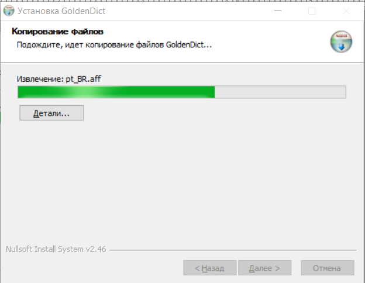
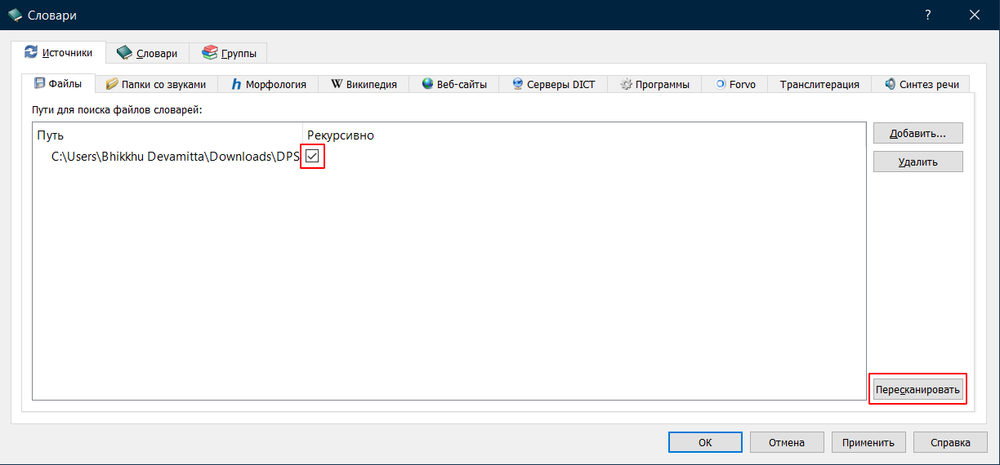

# Установка GoldenDict на Windows

## В кратце
1. Скачайте последнюю версию DPD [здесь](https://github.com/digitalpalidictionary/digitalpalidictionary/releases).
2. Установите версию 1.5 [GoldenDict](https://sourceforge.net/projects/goldendict/files/early%20access%20builds/GoldenDict-1.5.0-RC2-372-gc3ff15f-Install.exe/download).
3. В настройках укажите GoldenDict папку с DPD.

Вот [видео](https://www.youtube.com/watch?v=KZ4CecdVL0k), чтобы помочь вам с установкой на Windows от [канала Learn Pali на Youtube](https://www.youtube.com/channel/UC73nNRzMzvweRb52ArFG3Gg).

Ниже приведены подробные инструкции в текстовом формате.

## Установка GoldenDict
1. Скачайте последнюю версию GoldenDict с [Sourceforge](https://sourceforge.net/projects/goldendict/files/early%20access%20builds/GoldenDict-1.5.0-RC2-372-gc3ff15f-Install.exe/download).
2. Перейдите в вашу папку `Загрузки` и дважды щелкните `GoldenDict-1.5.0-RC2-372-gc3ff15f-Install.exe`.
   
3. Выберите ваш язык. Нажмите **OK**.
   
4. Нажмите Далее.
   
5. Нажмите Я согласен.
   
6. Выберите место установки и нажмите **Далее**.
   
7. Нажмите Установить.
   
8. Установка…
   
9. Нажмите Готово.
   

## Скачать DPD
Скачайте последнюю версию Цифрового Палийского Словаря с [Github](https://github.com/digitalpalidictionary/digitalpalidictionary/releases).

## Создание папки GoldenDict
Рекомендуется создать легко доступную папку GoldenDict, например `\Documents\GoldenDict`.

## Распаковка
1. Щелкните правой кнопкой мыши на файле .zip в папке Загрузки и выберите "Извлечь все".
   
2. Выберите папку `\Documents\GoldenDict` и нажмите Извлечь.
   
3. Теперь в `\Documents\GoldenDict` будет папка `DPD`.
   

## Настройка GoldenDict
1. Запустите GoldenDict из меню Пуск.
   
2. Откройте Меню > Правка > Словари (клавиша F3).
   
3. Нажмите Добавить.
   
4. Перейдите в `\Documents\GoldenDict` и нажмите Выбрать папку.
5. Установите флажок **Рекурсивно** (это гарантирует добавление всех подпапок).
   
6. Нажмите ОК.
   
7. Подождите, пока словарь будет проиндексирован.
   

Всё готово!

Можно почитать, как [настроить горячую клавишу](setup_hotkey.html), чтобы вы могли щелкнуть на любое слово на пали в любом тексте и мгновенно открыть его в словаре.