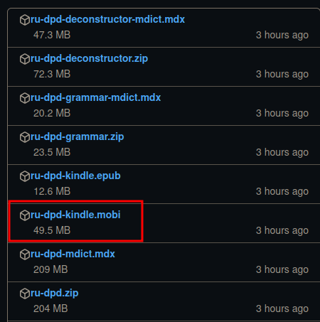
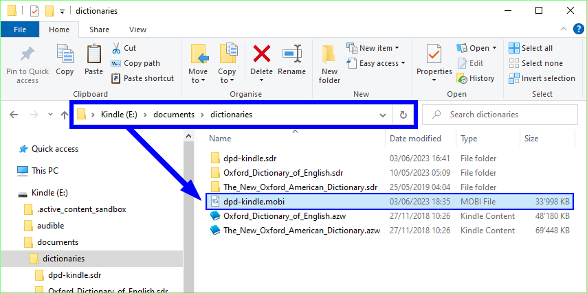

# DPD на Kindle

Теперь доступна легкая версия DPD для Amazon Kindle.

## Установка

1. Загрузите последнюю версию **dpd-kindle.mobi** с [этой страницы на GitHub](https://github.com/digitalpalidictionary/digitalpalidictionary/releases).
   

2. Скопируйте этот файл в следующую папку на вашем Kindle: `/documents/dictionaries`
   

3. Перезагрузите Kindle.

4. Нажмите и удерживайте любое пали слово, затем выберите словарь.
   

5. Выберите **Цифровой Словарь Пали** из списка доступных словарей.
   

6. Вот и всё, вы настроились! Наслаждайтесь возможностью просмотра измененных форм любого пали слова.
   