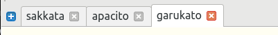
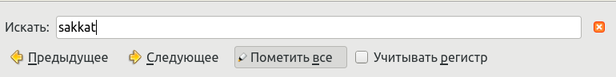
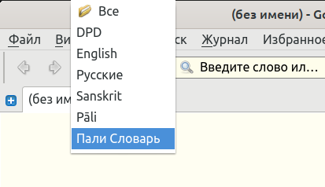
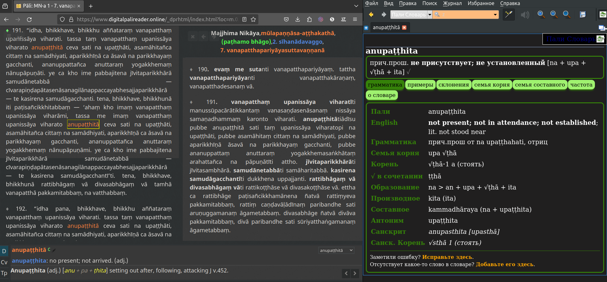

## Настройка расширенных функций в GoldenDict

### Ctrl-клик для открытия слова в новой вкладке

Клик на любом слове откроет его в той же вкладке. Ctrl-клик на любом слове откроет его в новой вкладке, позволяя вам просматривать несколько слов одновременно.

### Добавление других словарей

Чтобы добавить больше словарей в GoldenDict, просто загрузите любой словарь в формате, совместимом с GoldenDict (Stardict, Babylon, Lingoes и т. д.) и добавьте эту папку в папку GoldenDict `Documents/GoldenDict`.

Существует множество палийских словарей для GoldenDict, попробуйте [Simsapa](https://github.com/simsapa/simsapa-dictionary/releases) для начала. Вы можете установить их индивидуально, или `combined-dictionary-stardict.zip` содержит все словари.

### Поиск на странице

Чтобы найти определенное слово на странице, используйте сочетание клавиш **Ctrl-F**, или перейдите в Меню > Поиск > Поиск на странице.

Это откроет диалоговое окно, позволяющее быстро найти конкретное слово, которое вы ищете на странице.

### Создание групп

Когда у вас установлено несколько словарей, охватывающих разные языки, рекомендуется создавать группы.

Перейдите в Меню > Редактировать > Словари (сочетание клавиш F3) и перейдите на вкладку **Группы**. Создайте новую группу и перетащите словари в группу.

Теперь группа будет отображаться в выпадающем списке на главной странице.

Это помогает ограничить результаты поиска, что важно для полнотекстовых поисков.

### Полнотекстовый поиск

Обычный поиск ищет только заголовки, но полнотекстовый поиск анализирует всё содержимое каждой статьи.

Сначала выберите группу, в которой хотите искать, иначе вы получите слишком много результатов.

Затем откройте Меню > Поиск > Полнотекстовый поиск (сочетание клавиш Ctrl+Shift+F).

Это откроет диалоговое окно.

Вы также можете вводить несколько слов, и они будут найдены, даже если они не являются смежными друг с другом.

### Тёмный режим

Вы можете установить тёмный режим для GoldenDict, следуя инструкциям [здесь](https://github.com/goldendict/goldendict/wiki/GoldenDict-Dark-Theme#how-to-install-goldendict-dark-theme).

Пока вы этим занимаетесь, установите расширение [Dark Reader для Chrome](https://chrome.google.com/webstore/detail/dark-reader/eimadpbcbfnmbkopoojfekhnkhdbieeh?hl=en) для комфортного чтения Пали на устаревших глазах.

